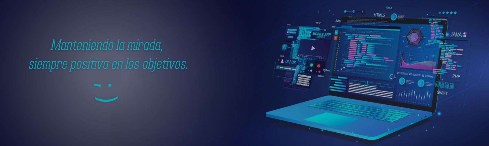
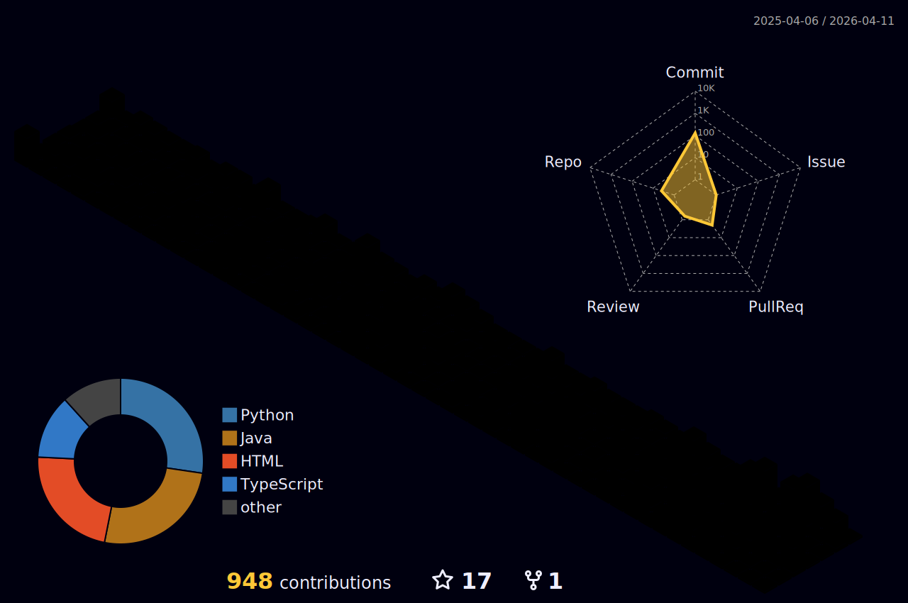

#  Hola! Mi nombre es Nicolás  

---

## 🎯 Sobre mí  

Soy estudiante avanzado de programación, cursando el último cuatrimestre de mi carrera universitaria. Con más de 2 años de formación y experiencia en proyectos, estoy enfocado en especializarme en el desarrollo Front-End y en complementar mis conocimientos.  

Me gusta crear aplicaciones funcionales y atractivas, combinando diseño con tecnologías, siempre estoy abierto a aprender y asumir nuevos desafíos que impulsen mi crecimiento profesional.  

---

## 📂 Proyectos Destacados  

- **[MemoPotter](https://github.com/nicoKaminski/Memo-Potter)**  
  _Juego interactivo de memoria (tipo memotest) desarrollado con Node.js, APIs REST y tecnologías modernas._

- **[Universidad](https://github.com/nicoKaminski/universidad)**  
  _Sistema CRUD para la gestión de estudiantes y cursos, implementado con Node.js, Express y MySQL._

- **[Machete C++](https://github.com/nicoKaminski/Cplusplus-Usos)**  
  _Ejemplos y usos de C++ que abarcan diferentes conceptos, desarrollados para estudiar y practicar los fundamentos del lenguaje C++.._
  
- **[Otros Proyectos](https://github.com/nicoKaminski)**  
  _Descubre más trabajos en mi perfil de GitHub._

---

## ⚡ Tecnologías que uso  

### Lenguajes  
&color=rgb(249%2C155%2C41)%20)
&color=rgb(226%2C79%2C38))
&color=rgb(64%2C159%2C217))
&color=rgb(247%2C223%2C30))
https://img.shields.io/badge/TypeScript-white?logo=typescript&logoColor=white&color=%233178C6

### Frameworks y Herramientas  
&labelColor=rgb(2A313C)&color=rgb(129%2C205%2C54))
&color=%23DD3A0A)
&labelColor=rgb(2A313C)&color=rgb(203%2C70%2C33))
&labelColor=%23ffffff&color=rgb(11%2C114%2C149))
https://img.shields.io/badge/Figma-white?logo=figma&labelColor=2A313C&color=F25425

---

## 🚀 Trabajando en...  

- **Último cuatrimestre de la carrera universitaria** para obtener mi título.  
- Diseñar y construir un portfolio profesional para destacar mis proyectos.  
- Aprender React para potenciar mis habilidades en desarrollo Front-End.  

---

## 🌐 Contacto  

  
  
 