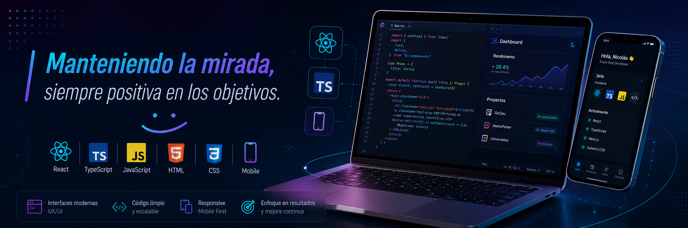

# ¡Hola! Soy Nico 👋

### Desarrollador de software full stack con enfoque en frontend

## 🎯 Sobre mí

Soy Técnico Universitario en Desarrollo de Software, con foco principal en el desarrollo frontend con **React y TypeScript**, orientado a crear interfaces claras, escalables y pensadas para las personas que las usan.

Trabajo también en backend con tecnologías como **Node.js, Express, Java y Spring Boot**, además de bases de datos relacionales como **PostgreSQL, MariaDB y MySQL**, lo que me permite participar en el ciclo completo de una aplicación y trabajar sobre integración, lógica, validaciones y datos cuando el producto lo necesita.

Mi experiencia en **UX/UI** complementa el desarrollo técnico y me ayuda a pensar cada solución más allá del código, buscando que arquitectura, funcionalidad y experiencia de usuario trabajen juntas.

## 🧭 Cómo trabajo

Primero busco entender bien el problema, discutir alternativas y elegir la solución que mejor se adapta al contexto. A partir de ahí defino el alcance, el orden de implementación y los criterios con los que voy a evaluar el resultado.

La **IA forma parte de mi proceso como herramienta de apoyo** para investigar, analizar alternativas, planificar y revisar soluciones, manteniendo las decisiones y la validación final bajo mi criterio.

**Diseño → Debate → IA asistida → Implementación → Revisión → Validación**

## 📂 Proyectos Destacados

- **[GeClau - Gestión de Clases y Aulas](https://grupo6s.com/)**
  _Sistema de gestión académica desarrollado en equipo para resolver la organización de aulas, horarios y clases en UTN Mar del Plata._

  _Mi participación incluye frontend, UX/UI, análisis funcional, integración y contribuciones backend. Actualmente se encuentra implementado y continúa evolucionando._

- **[Horas Claras](https://horas-claras.vercel.app/)**
  _Aplicación web para registrar horas de trabajo, revisar pendientes y controlar la carga en Jira. Desarrollada con Next.js, React, TypeScript, Supabase Auth, PostgreSQL y Row Level Security._

- **[BitiCraft](https://biticraft.vercel.app/)**
  _Experiencia web para un emprendimiento de productos artesanales, combinando identidad visual, UX/UI y desarrollo. Desarrollada con Next.js, React y TypeScript. (proximamente integrado con Shopify)_

- **[TRACAM](https://tracam.grupo6s.com/login)**
  _MVP de una aplicación web para centralizar la gestión operativa y trazabilidad de viajes de camiones. Desarrollo full stack con React, TypeScript, NestJS y PostgreSQL._

## 🧪 Otros proyectos

- **[MemoPotter](https://github.com/nicoKaminski/Memo-Potter)**
  _Proyecto académico de un juego de memoria desarrollado con JavaScript, Node.js y Express, utilizando una API externa._

- **[Universidad](https://github.com/nicoKaminski/universidad)**
  _Proyecto académico de gestión universitaria desarrollado con Node.js, Express y TypeScript._

- **[Repos](https://github.com/nicoKaminski?tab=repositories)**
  _Podés encontrar más proyectos, prácticas y trabajos académicos en mis repositorios._

## ⚡ Stack principal

&color=%2361DAFB>)

&labelColor=rgb(50%2C51%2C48)&color=rgb(129%2C205%2C54)>)

<strong>🧰 Tecnologías y herramientas adicionales</strong>

 

**Desarrollo**

**Datos y plataformas**

**Herramientas y diseño**

---

## 🚀 Trabajando en...

- Recibido como **Técnico Universitario en Desarrollo de Software** 🎓
- Me desempeño como **Programador full stack en Equalitas**, participando tanto en frontend como en backend, con foco principal en frontend.
- **GeClau:** continúo participando en el mantenimiento y evolución del sistema
- Sigo desarrollando proyectos y profundizando mis conocimientos en desarrollo web full stack, aplicando **buenas prácticas y metodologías ágiles**.
- Siempre en búsqueda de **oportunidades y nuevos desafíos** para seguir creciendo profesionalmente.

<!--  -->

## 🌐 Contacto

 

