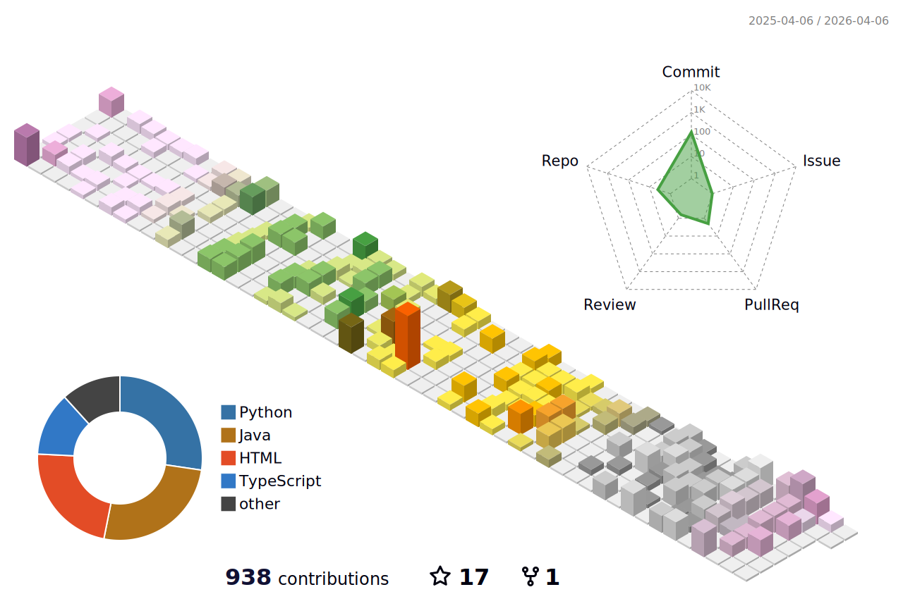

#  Hola! Mi nombre es Nicolás  

---

## 🎯 Sobre mí  

Soy estudiante avanzado de programación, cursando el último cuatrimestre de mi carrera universitaria. Con más de 2 años de formación y experiencia en proyectos, estoy enfocado en especializarme en el desarrollo Front-End y en complementar mis conocimientos.  

Me gusta crear aplicaciones funcionales y atractivas, combinando diseño con tecnologías, siempre estoy abierto a aprender y asumir nuevos desafíos que impulsen mi crecimiento profesional.  

---

## 📂 Proyectos Destacados  

- **[MemoPotter](https://github.com/nicoKaminski/Memo-Potter)**  
  _Juego interactivo de memoria (tipo memotest) desarrollado con Node.js, APIs REST y tecnologías modernas._

- **[Universidad](https://github.com/nicoKaminski/universidad)**  
  _Sistema CRUD para la gestión de estudiantes y cursos, implementado con Node.js, Express y MySQL._

- **[Machete C++](https://github.com/nicoKaminski/Cplusplus-Usos)**  
  _Ejemplos y usos de C++ que abarcan diferentes conceptos, desarrollados para estudiar y practicar los fundamentos del lenguaje C++.._
  
- **[Otros Proyectos](https://github.com/nicoKaminski)**  
  _Descubre más trabajos en mi perfil de GitHub._

---

## ⚡ Tecnologías que uso  

### Lenguajes  

### Frameworks y Herramientas  
[Node.js](https://img.shields.io/badge/Node.js-43853D?style=for-the-badge&logo=node.js&logoColor=white)

---

## 🚀 Trabajando en...  

- **Último cuatrimestre de la carrera universitaria** para obtener mi título.  
- Diseñar y construir un portfolio profesional para destacar mis proyectos.  
- Aprender React para potenciar mis habilidades en desarrollo Front-End.  

## 🧑🏻‍💻 Lenguajes...  

---

## 🌐 Contacto  

  
  
