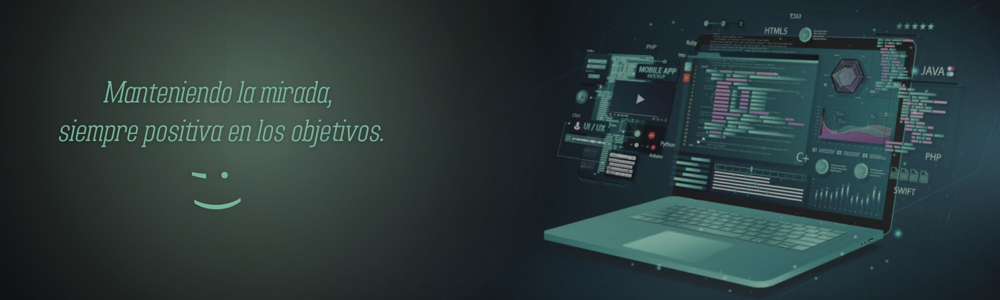
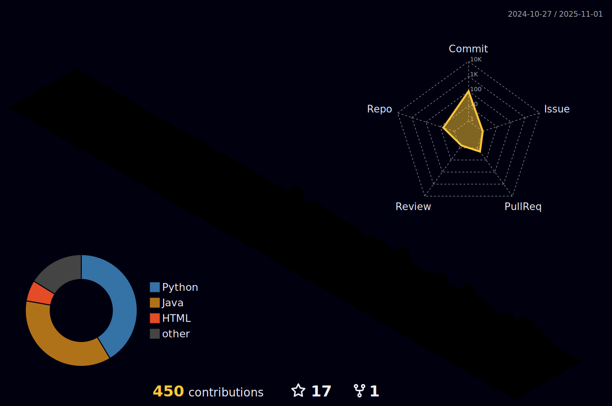

#  Hola! Mi nombre es Nicolás

---

## 🎯 Sobre mí

Soy estudiante avanzado de programación, cursando el último cuatrimestre de mi carrera universitaria. Con más de 2 años de formación y experiencia en proyectos, estoy enfocado en especializarme en el desarrollo Front-End y en complementar mis conocimientos.

Me gusta crear aplicaciones funcionales y atractivas, combinando diseño con tecnologías, siempre estoy abierto a aprender y asumir nuevos desafíos que impulsen mi crecimiento profesional.

---

## 📂 Proyectos Destacados

- **[MemoPotter](https://github.com/nicoKaminski/Memo-Potter)**  
  _Juego interactivo de memoria (tipo memotest) desarrollado con Node.js, APIs REST y tecnologías modernas._

- **[Universidad](https://github.com/nicoKaminski/universidad)**  
  _Sistema CRUD para la gestión de estudiantes y cursos, implementado con Node.js, Express y MySQL._

- **[Machete C++](https://github.com/nicoKaminski/Cplusplus-Usos)**  
  _Ejemplos y usos de C++ que abarcan diferentes conceptos, desarrollados para estudiar y practicar los fundamentos del lenguaje C++.._
- **[Otros Proyectos](https://github.com/nicoKaminski)**  
  _Descubre más trabajos en mi perfil de GitHub._

---

## ⚡ Tecnologías que uso

### Lenguajes

&color=rgb(249%2C155%2C41)%20>)
&color=rgb(226%2C79%2C38)>)
&color=rgb(64%2C159%2C217)>)
&color=rgb(247%2C223%2C30)>)

### Frameworks y Herramientas

&labelColor=rgb(50%2C51%2C48)&color=rgb(129%2C205%2C54)>)
&color=%23DD3A0A>)

&labelColor=rgb(50%2C51%2C48)&color=rgb(203%2C70%2C33)>)
&labelColor=%23ffffff&color=rgb(11%2C114%2C149)>)

---

## 🚀 Trabajando en...

- **Último cuatrimestre de la carrera universitaria** para obtener mi título.
- Diseñar y construir un portfolio profesional para destacar mis proyectos.
- Aprender React para potenciar mis habilidades en desarrollo Front-End.

---

## 🌐 Contacto

 
